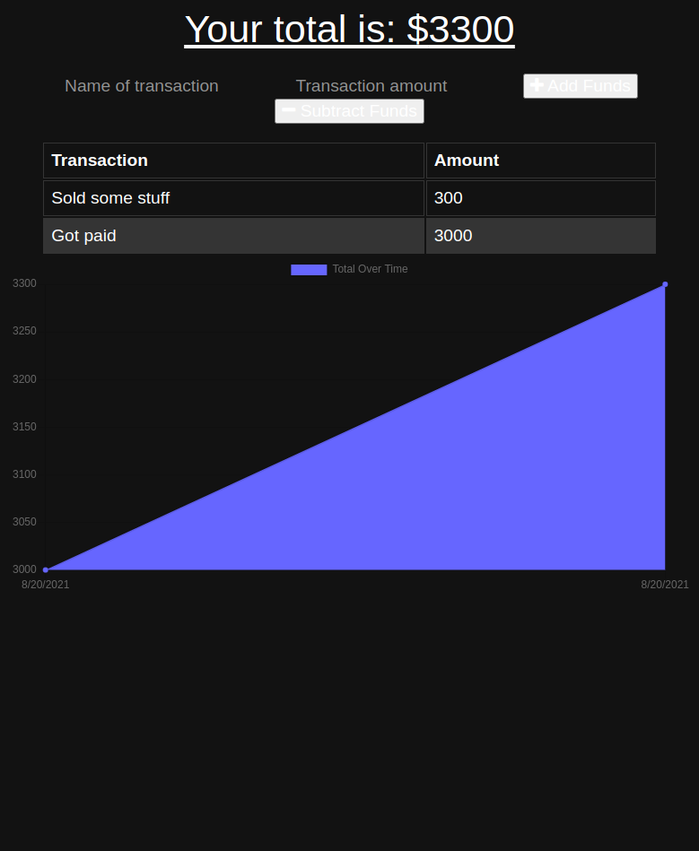

# PWA Budget Manager

[Link to Deployed application](https://mysterious-anchorage-47746.herokuapp.com/)

    

## Table of Contents
    
[Description](#description)
[Installation](#installation-instructions)
[Usage Info](#usage-info)
[contribution](#contribution)
[Testing Instructions](#test-instructions)
[License](#license)
[Questions](#questions)
[Tools and Technologies](#tools-and-technologies)
    

## Description
    A progressive web app to help you manage your budget. It can be used either
    online or offline so you do not have to worry about losing track of your 
    finances if you do not have internet connection.
            
## Tools and Technologies

* HTML
* CSS
* JavaScript
* MongoDB
* Node.js
* Express.js
* IndexedDB

## Installation Instructions
    Installation is not necessary. 

## Usage info
    To start using simply open the page and start adding your budget information.

## Contribution
    contributions are welcome upon request.

## Test Instructions
    undefined.    

## License
    This project is covered under MIT license.

## Questions
    For questions please refer to 
[LinkedIn](https://www.linkedin.com/in/romulo-goncalves-45602539/) 
    or
    romulojusto@gmail.com
    
